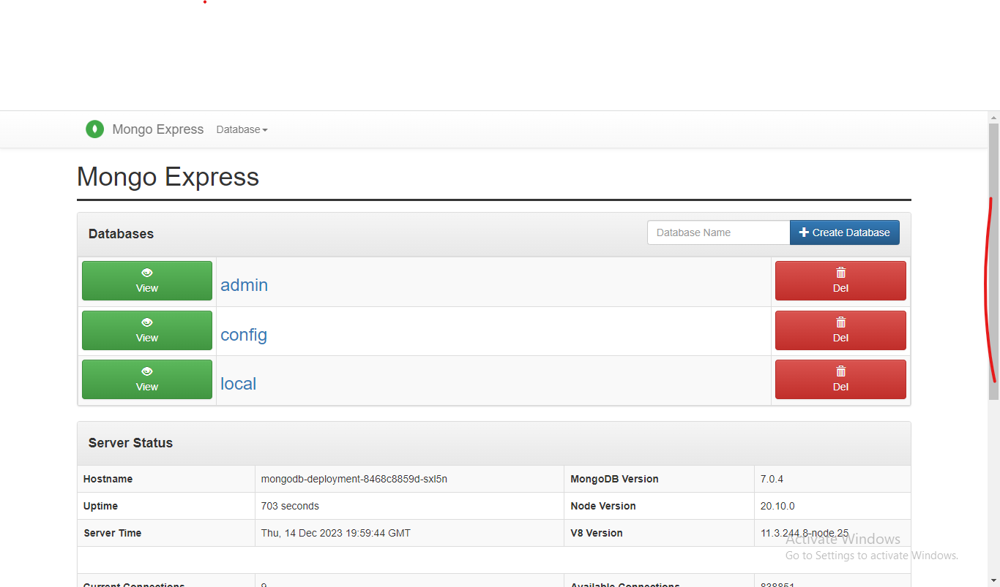

# MONGODB DEPLOYMENT USING KUBERNETES (MINIKUBE WAS USED TO ASSUME THE ROLE OF BOTH MASTERS AND SLAVES)



this is a deployment process that explains deploying mongo database using DevOps best practises.

secrets and configmap components of kubernetes were used to pass the database password and username, this provides security best practise in deploying a mongoDB.

the mongoDB was deployed at the frontend using mongo-express. 

# the following requirements below are necessary when using minikube for deployment:
2 CPUs or more
2GB of free memory
20GB of free disk space
Internet connection
Container or virtual machine manager, such as: Docker, QEMU, Hyperkit, Hyper-V, KVM, Parallels, Podman, VirtualBox, or VMware Fusion/Workstation

The above must be considered when setting up your cloud

To deploy this application, ensure that you have the requirements in the table below installed on the host machine before deploying the application.

|Installation|Required |
| ------------- | ------------- |
| Docker Installed  | :heavy_check_mark:  |
| minikube Installed | :heavy_check_mark:  |
| kubectl Installed | :heavy_check_mark:  |

When you are done with the above installations, check the services if they are well installed and running fine. 

Define your default driver for minikube with the command. Here our default driver is docker

```
minikube start --driver=docker

```
OR

```
minikube config set driver docker   #TO SET DOCKER AS DRIVER

```

Then, run the start command

```
minikube start

```

clone your repo and cd to the repo. 

```
git clone https://github.com/akurasy/k8s-mongo-testing.git && cd k8s-mongo-testing.git

```
Use kubectl to deploy the application

```
kubectl apply -f /*.yml

```

The above command will deploy anything that contains .yml file. 
OR
you can run the deployment individually by using the filename to deploy one after the other.
EXAMPLE: kubectl apply -f mongo-app.yml


To view the deployed application, forward nodePort traffic to the service

```
kubectl port-forward --address 0.0.0.0 svc/webapp-service 30007:8081
#this will open to allow connection from anyone
# webapp-service = name of service for mongo nodePort, 30007= nodePort,  8081 = application port

```

# Browse mongoserver on publicIP:30007

You can configure the names and ports to suit your desired style.

to see the username and password for mongo for a test environment, use the following:
username: admin
password: pass

this can be gotten from

```
# kubectl logs pod-name

```

Pls, remember to open the necessary ports in your cloud console security group.  

# Happy Mongo 💚💚💚
